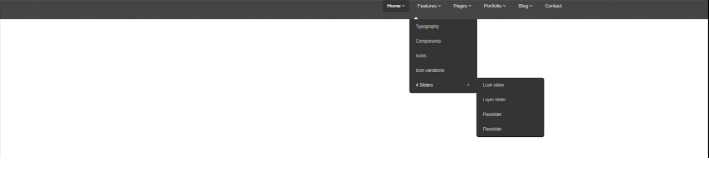

# Домашняя работа

1)Повторяем материал лекции

2)Читаем информационные ресурсы:
 * https://webref.ru/css/z-index
 * https://webformyself.com/metody-skrytiya-elementov-v-css/
 * https://webformyself.com/metody-skrytiya-elementov-v-css/

3)Верстаем макет. Выравниваем элементы по горизонтали при помощи float(еще практикуемся в исп-нии).

  * стрелочки на кнопках делаем через псевдоэлементы
  * добавляем анимацию "первой выпадайки" которая плавно появляется под главным меню.
  * добавляем анимацию "2рой выпадайки" которая просто плавно появляется.
